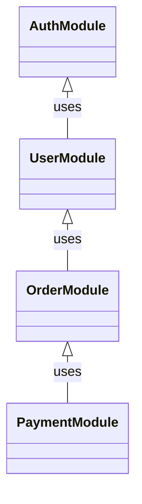
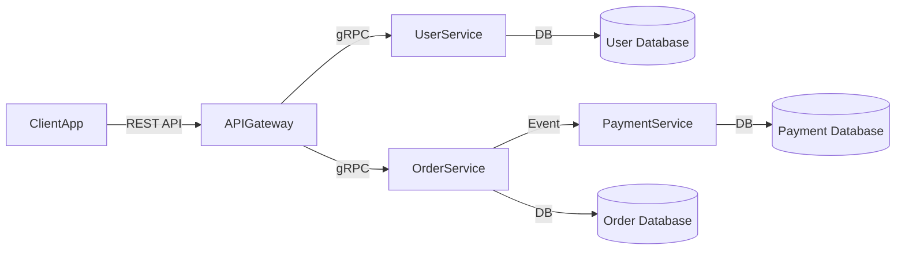
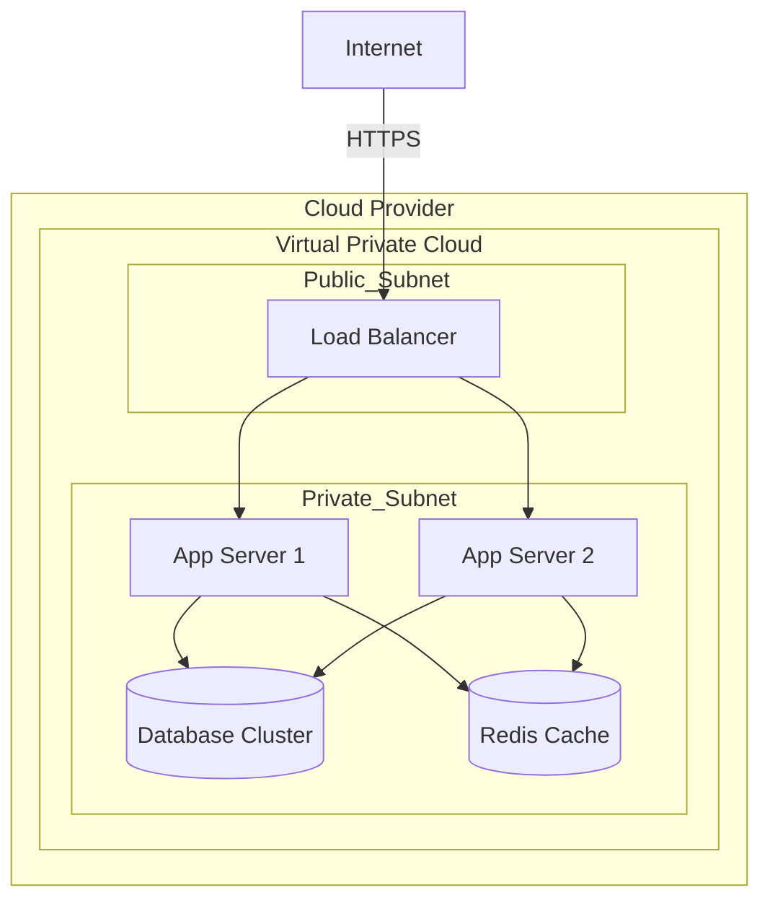
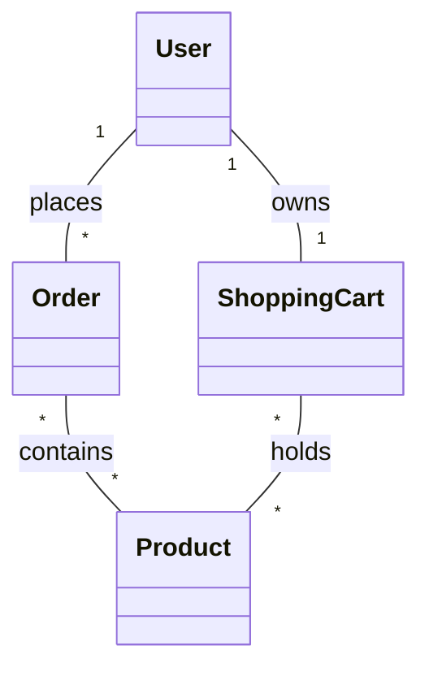
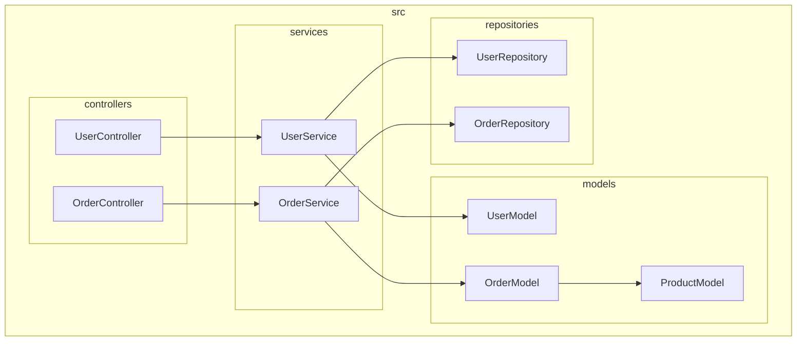
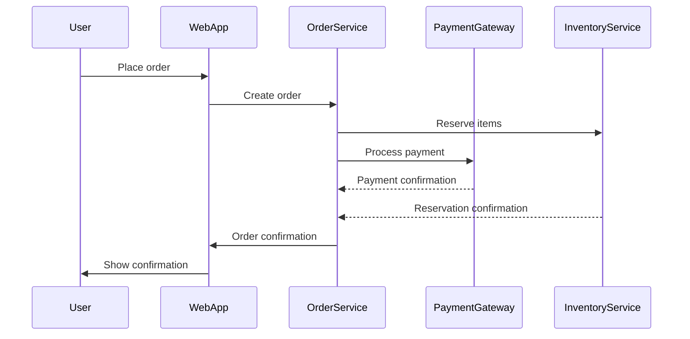
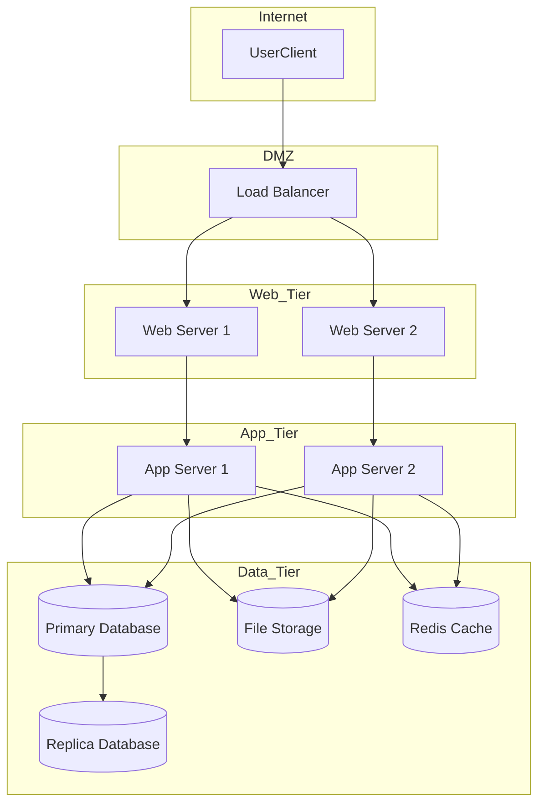
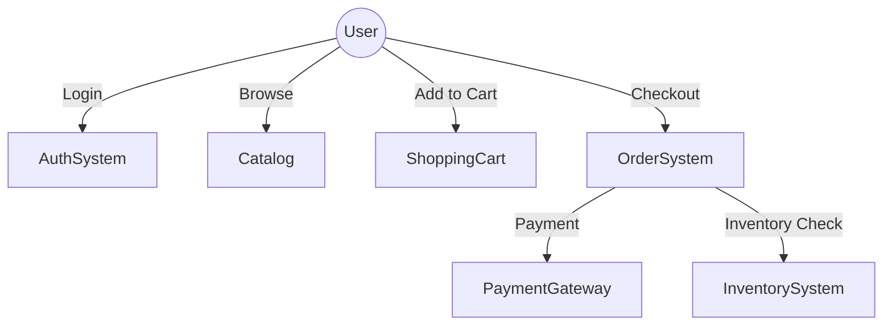

# Software Architecture

 

## CMU SEI Three Views

The CMU SEI (Software Engineering Institute) Three Views is a classic approach to documenting software architecture. The three views are:

### 1. Module View (Decomposition View)
- **What it shows**: The static structure of the system in terms of modules (e.g., packages, classes, files).
- **Purpose**: Shows how the system is decomposed into implementation units and how these units relate to each other.
- **Audience**: Developers, maintainers.
- **Details**: 
    -Shows how the system is broken down into modules (e.g., packages, classes, files).
    - Focuses on code structure, encapsulation, and dependencies.
- **Example**: A class diagram showing how classes are organized into packages.

### 2. Component-and-Connector View (C&C View)
- **What it shows**: The dynamic structure of the system as a set of components (units of computation) and connectors (interaction mechanisms).
- **Purpose**: Illustrates how runtime elements interact, such as processes, threads, data flows, and communication paths.
- **Audience**: System integrators, testers, performance engineers.
- **Details**: 
    - Shows the runtime structure: components (processes, services) and connectors (communication, data flow).
    - Focuses on how parts of the system interact at runtime.
- **Example**: A diagram showing how services communicate over a network.

### 3. Allocation View
- **What it shows**: The mapping of software elements to the environment, such as hardware, file systems, or teams.
- **Purpose**: Shows how software is deployed, assigned to hardware, or mapped to development teams.
- **Audience**: System engineers, deployment engineers, project managers.
- **Details**: 
    - Shows how software elements are mapped to hardware, file systems, or teams.
    - Focuses on deployment, physical distribution, or team responsibility.
- **Example**: A deployment diagram mapping software components to servers.

 

## RUP 4+1 Views

RUP uses the "4+1" View Model, which consists of five views:

### 1. Logical View
- **What it shows**: The object model of the design (e.g., class diagrams).
- **Purpose**: Addresses the functionality that the system provides to end-users.
- **Audience**: End-users, analysts, designers.
- **Details**: 
    - Shows the object model of the design (e.g., class diagrams).
    - Focuses on functionality provided to end-users.
- **Example**: A class diagram showing how classes are organized into packages.

### 2. Development View (Implementation View)
- **What it shows**: The static organization of the software in the development environment (e.g., module structure).
- **Purpose**: Focuses on software management, configuration, and reuse.
- **Audience**: Programmers, software managers.
- **Details**: 
    - Shows the static organization of the software in the development environment (e.g., module structure).
    - Focuses on software management, configuration, and reuse.
- **Example**: A class diagram showing how classes are organized into packages.

### 3. Process View
- **What it shows**: The dynamic aspects of the system, such as processes and their interactions.
- **Purpose**: Addresses concurrency, performance, and scalability.
- **Audience**: System integrators, performance engineers.
- **Details**: 
    - Shows the dynamic aspects of the system, such as processes and their interactions.
    - Focuses on concurrency, performance, and scalability.
- **Example**: A class diagram showing how classes are organized into packages.

### 4. Physical View (Deployment View)
- **What it shows**: The mapping of software onto hardware and the physical distribution of components.
- **Purpose**: Deals with system topology, communication, and deployment.
- **Audience**: System engineers, deployment engineers.
- **Details**: 
    - Shows the mapping of software onto hardware and the physical distribution of components.
    - Focuses on system topology, communication, and deployment.
- **Example**: A class diagram showing how classes are organized into packages.

### 5. Use Case View ("+1" View)
- **What it shows**: The scenarios and use cases that drive the architecture.
- **Purpose**: Ties all the other views together by showing how they support the required functionality.
- **Audience**: All stakeholders.
- **Details**: 
    - Shows the scenarios and use cases that drive the architecture.
    - Focuses on tying all the other views together by showing how they support the required functionality.
- **Example**: A class diagram showing how classes are organized into packages.

## Summary Table

| Framework      | View Name                   | Focus/What it Shows                     |
|----------------|----------------------------|----------------------------------------|
| CMU SEI        | Module                     | Static structure (modules, packages)    |
|                | Component-and-Connector    | Runtime structure (components, connectors) |
|                | Allocation                 | Mapping to environment (hardware, teams) |
| RUP (4+1)      | Logical                    | Object model, functionality             |
|                | Development                | Implementation structure                |
|                | Process                    | Dynamic behavior, concurrency           |
|                | Physical                   | Deployment, hardware mapping            |
|                | Use Case                   | Scenarios, requirements                 |
